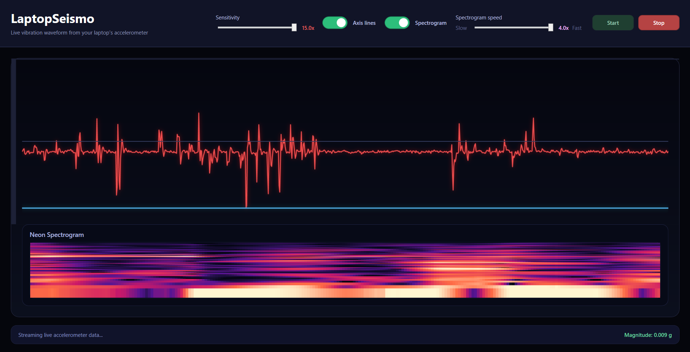

# 🌋 LaptopSeismo

**LaptopSeismo** turns your laptop’s accelerometer into a **real-time digital seismograph.**  
Every tap, shake, or subtle vibration is visualized as a smooth, glowing waveform — live on your screen.  
Built with **.NET 9** and **WPF**, it visualizes real accelerometer data directly from your hardware sensors.

---

## 🖼️ Preview



> The waveform reacts instantly to any movement — even light desk vibrations.

---


## ✨ Features

- 📈 **Live vibration waveform** from your laptop’s accelerometer  
- ⚙️ Adjustable **sensitivity** slider for fine-tuned response  
- 🌑 **Dark, modern UI** inspired by real seismographs  
- 📊 Optional **axis lines** for clean reference visuals  
- ⚡ Smooth 60 FPS drawing with WPF hardware acceleration  
- 🧭 Uses the Windows **Sensor API** (`Windows.Devices.Sensors`)  

---

## 🧠 How It Works

LaptopSeismo reads live acceleration values from your laptop’s internal motion sensor:

```csharp
using Windows.Devices.Sensors;
var accel = Accelerometer.GetDefault();
